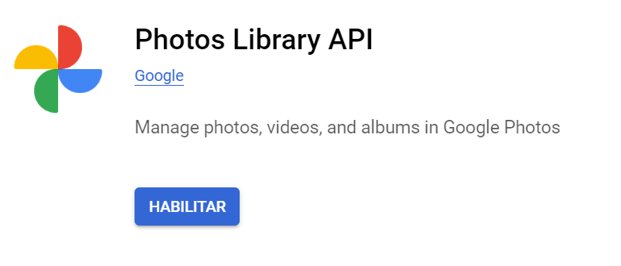
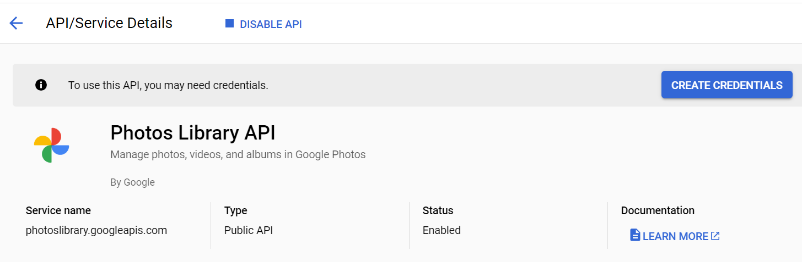
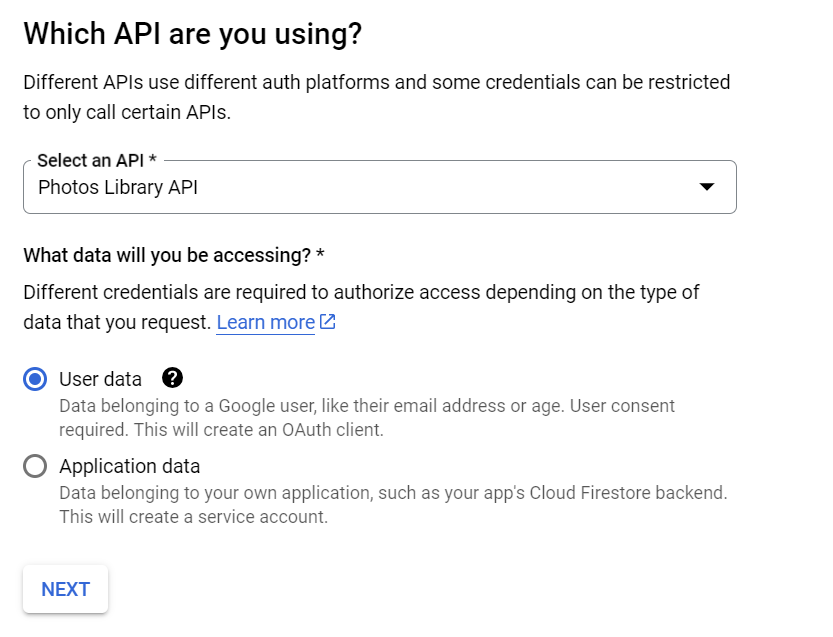
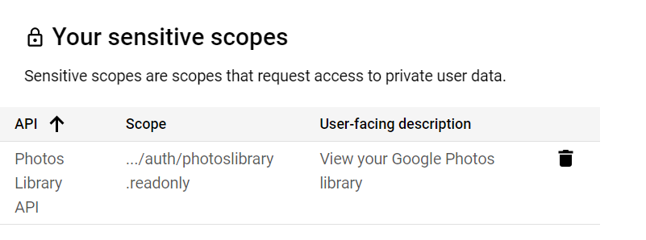
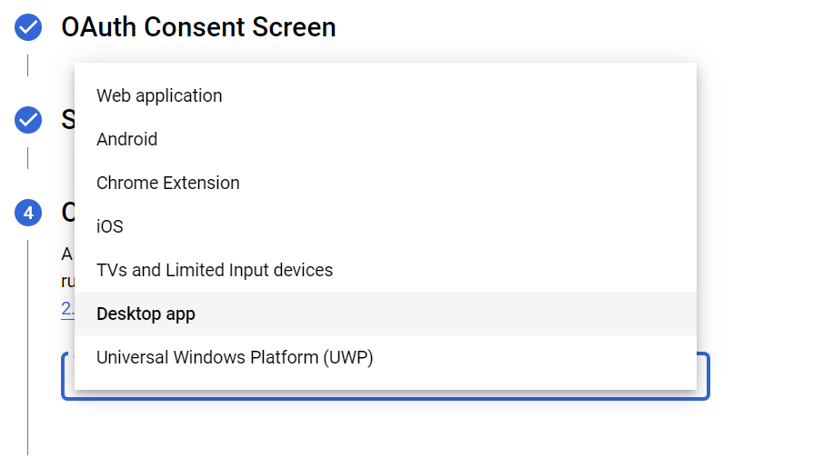
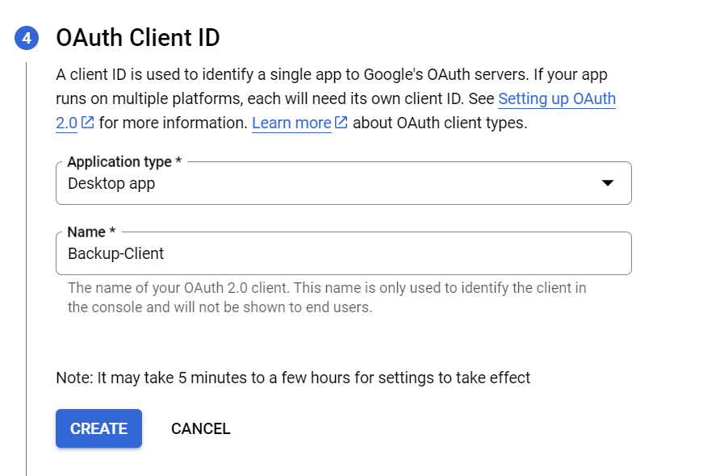

# Photo backup

## Abstract

Download all the photos in google photos account for a given year

The script loops through all the media files in the user's library and downloads
each file. A folder is created for every day that contains media files.

If the file already exists in the local folder it's skipped. If more than 5 files are skipped the process stops.

Warning: Sometimes the API may reach its daily limit, wait until next day or ask google an increased quota.

## Usage

### Parameters

- year: in format yyyy (by default select the current year)
- folder: The folder where to store files, by default is "photos" but you can specify another folder or unit.

### Examples

- Download all files of year 2024 to photos folder

```sh
python3 backup.py 2024
```

- Download all files of year 2003 to photos_backup folder

```sh
python3 backup.py 2003 photos_backup
```

- Download all the current year files to photos folder

```sh
python3 backup.py
```

- Using linux, shell to launch the current year backup

```sh
./backup.sh
```

- Using windows, bat to launch the current year backup

```sh
backup
```

## Authentication step by step guide

- Make sure you can connect with your google account to developers.google.com
- Go to <https://console.cloud.google.com/apis/library/photoslibrary.googleapis.com> and Enable API
- 
- Go to <https://console.cloud.google.com/apis/library>
- Click "Create Credentials"
- 
- Select "User Data"
- 
- Add, at least photoslibrary.readonly scope to the credentials
- 
- You'll see the scope added to the "Sensitive scopes" list in the credentials configuration page
- 
- Select "Desktop app" in the type of application
- 
- And give a name to the client application
- 
- Download yor credentials file, you will get a client_secret_xxxxxyyyy.json
- Rename your credentials file to only client_secret.json and store it in this folder (the project root folder)
- Go to the Oauth Consent Screen and add your email in the section "Test users" if you add your user you don't need to publish the app for everyone
- Launch ./backup.sh or python3 backup.py
- You'll see an authorization url, open it in a browser, select your user (the one that you've selected as "Test user" before), grant acces to the app as a tester and finally close this browser
- If everything has worked out you'll see messages that the files are already downloading to your photos folder.
- A token.pickle file has been created so the authorization is cached for some days, if the token.pickle token expires you'll need to grant permissions again.

## Guides

- <https://developers.google.com/photos/library/guides/overview>
